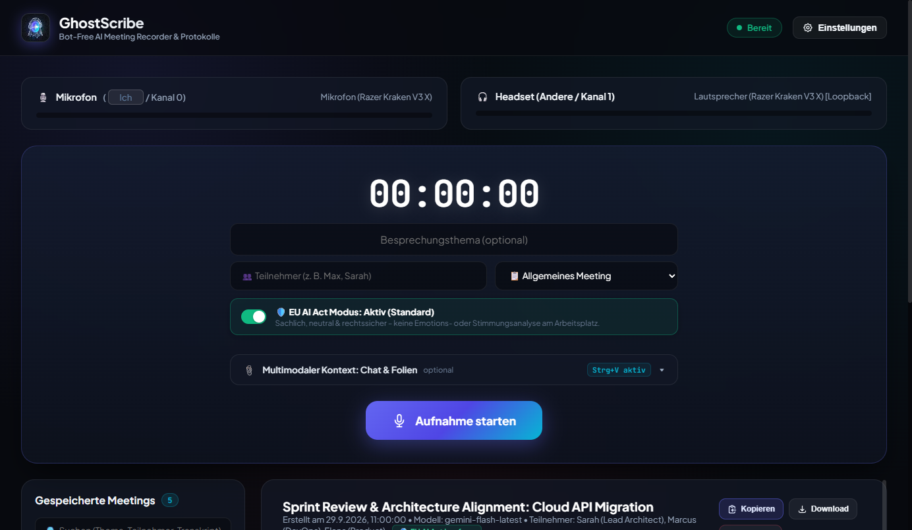
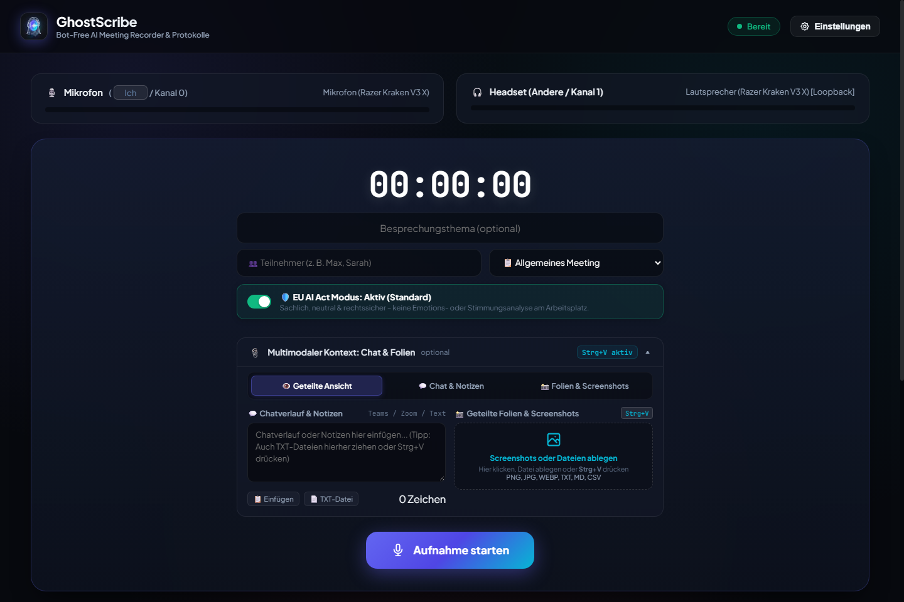
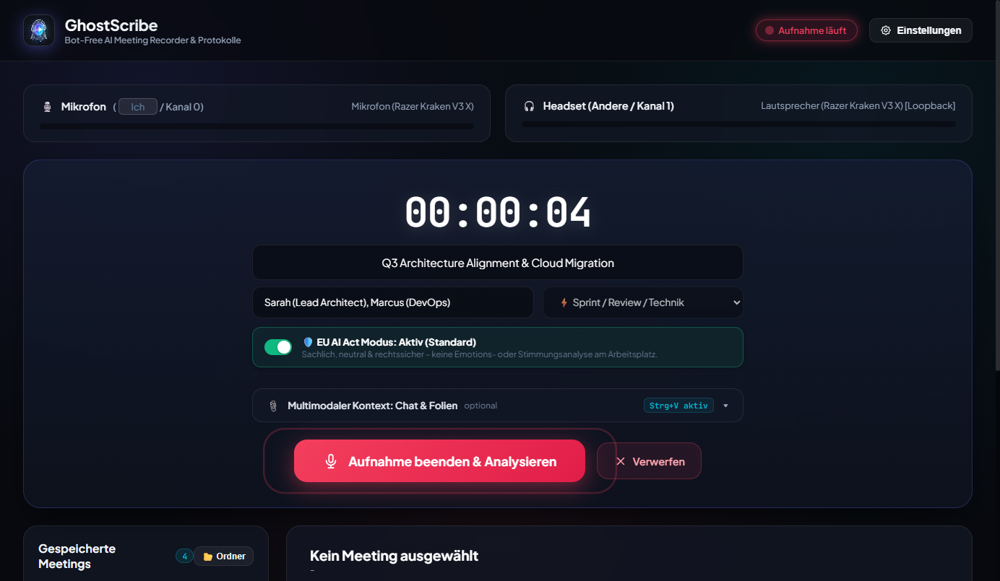
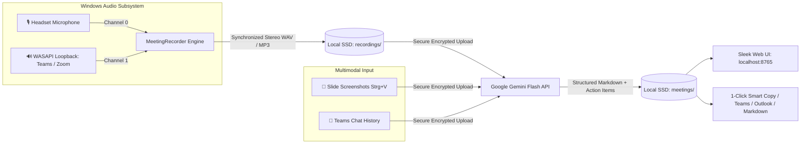

<div align="center">


# 🎙️ GhostScribe

### The Invisible, Bot-Free AI Meeting Recorder & Executive Minutes Generator

**Capture Microsoft Teams, Zoom & Google Meet calls directly on Windows — with zero bots, zero admin rights, hardware-isolated speaker diarization, and multimodal Gemini AI.**

[](https://github.com)
[](https://www.python.org/)
[-8E75C2?logo=google&logoColor=white)](https://ai.google.dev/)
[-success)](#why-ghostscribe--the-botless-advantage)
[](#-quickstart-for-windows)
[](LICENSE)

<br/>



</div>

---

## ⚡ Why GhostScribe? The "Botless" Advantage

Traditional AI meeting note-takers (Otter.ai, Fireflies, Read.ai) force an intrusive bot to join your call:
* ❌ **Annoying & Awkward:** Everyone gets an alert: *"Otter.ai has joined the call to record you"*.
* ❌ **Corporate IT Blacklist:** Corporate firewalls and compliance policies frequently kick out or ban external bots.
* ❌ **Cloud Privacy Risk:** Your conversations and proprietary company discussions sit on 3rd-party SaaS databases.
* ❌ **Hefty SaaS Subscriptions:** Cost $20 to $50 per user, every single month.

### 👻 The GhostScribe Way
GhostScribe records **discreetly on your Windows audio subsystem** (using native WASAPI Loopback on your headphones/speakers and your microphone). 
* **100% Invisible:** No bot joins. No plugin is installed into Teams or Zoom.
* **100% Local Storage:** Raw audio recordings and markdown minutes live only on your PC.
* **Zero Admin Rights:** Runs completely in user space. No administrative privileges required.
* **Pay Only Pennies:** Powered by your personal Google Gemini API key — typical cost is less than **$0.002 (a fraction of a cent!) per hour of meeting**.

---

## 🆚 GhostScribe vs. Traditional Meeting Bots

| Feature | 👻 GhostScribe | 🤖 Otter / Fireflies | 📝 MS Teams Copilot |
| :--- | :---: | :---: | :---: |
| **Visible Bot in Call** | **None (100% Invisible)** | Yes (joins call) | Yes (recording banner) |
| **Corporate IT Approval** | **Zero-Admin Required** | Often blocked | Tenant Admin required |
| **Audio Diarization** | **Hardware Stereo (2-Channel)** | Software guessing | Cloud processing |
| **Multimodal Slide Paste (`Strg+V`)** | **Yes (Direct Gemini Vision)** | ❌ No | ⚠️ Limited |
| **Meeting Chat Integration** | **Yes (Teams / Zoom)** | ❌ No | Yes |
| **EU AI Act Workplace Compliance** | **🛡️ 100% Compliant (Default)** | ❌ Risk (Emotion AI) | ⚠️ Cloud policy |
| **Emotion & Sentiment Radar** | **Optional Toggle (Off by default)** | Basic | Basic |
| **Headphone Channel Router** | **Yes (Mono / Stereo / Solo)** | ❌ No | ❌ No |
| **Data Ownership** | **100% Local on your SSD** | 3rd-party SaaS cloud | Microsoft Cloud |
| **Monthly Cost** | **Free / ~$0.002 per call** | $20 - $50 / user / mo | $30 / user / mo (E5) |

---

## ✨ Core Highlights

### 1. 🎚️ Hardware-Separated Stereo Diarization (Zero Speaker Hallucinations)
Instead of relying on AI to guess who is talking, GhostScribe synchronizes two isolated hardware channels:
* **Channel 0 (Left):** Your local headset microphone (*You / Local speaker*)
* **Channel 1 (Right):** WASAPI Loopback (*Remote participants / Teams audio*)

Because your voice and remote voices never bleed into the same track, Gemini diarizes speakers with 100% precision.

### 2. 📎 Multimodal Meeting Context: Slides, Architecture & Chat
Often, critical context in engineering or sales meetings is **shown on a slide** or **typed into Teams chat**, not spoken aloud:
* **`Strg+V` Clipboard Screenshot:** Simply hit `Win + Shift + S` during a presentation, paste into GhostScribe with `Strg+V`, and Gemini analyzes the architecture diagram or slide deck alongside the audio!
* **Chat Integration:** Paste meeting chat links, vote results, or Q&A snippets before uploading.

<div align="center">
  
</div>

### 3. 🛡️ EU AI Act Workplace Compliance (Default) & Optional Sentiment Radar
Under **Article 5(1)(f) of the EU AI Act (KI-Verordnung)**, AI systems that infer employee emotions at the workplace are strictly prohibited or heavily restricted. GhostScribe solves this with an enterprise-ready dual mode:
* **🛡️ EU AI Act Mode (Default):** 100% objective, fact- and decision-focused. Zero emotion profiling, zero psychological inferences, and objective task prioritization.
* **🎭 Sentiment & Dynamics Radar (Optional Toggle):** Available on demand for coaching, 1-on-1s, or sprint retrospectives to analyze sentiment, controversies, and team consensus.

### 4. 🔉 Built-In Web Audio Channel Router
Listening back to stereo recordings with hard-panned channels (Mic left, Teams right) causes ear fatigue. GhostScribe features a built-in real-time Web Audio API channel router:
* **`🔉 Beide Ohren (Mono)` (Default):** Perfectly centers all participants into both ears.
* **`🎧 Stereo`:** Preserves original stereo separation.
* **`👥 Nur Teams`:** Mutes your own microphone; soloes external participants.
* **`🎙️ Nur Ich`:** Isolates your microphone for self-review.

<div align="center">
  
</div>

### 5. 🪟 Seamless Workflow & Smart 1-Click Copy
* **Smart 1-Click Clipboard:** 1-click copies the protocol to your clipboard simultaneously formatted as **rich HTML** (for Microsoft Teams, Outlook, Word, Slack) and clean **Markdown** (for VS Code, Obsidian, Notion). No cumbersome menus or re-formatting required!
* **Instant Export:** Direct 1-click download of the complete protocol as `.md` file.
* **Independent Background Engine:** Closing or minimizing the browser tab does **not** stop the recording. A live heartbeat runs reliably in the background.

---

## 🏗️ Architecture & Dataflow



---

## 🚀 Quickstart for Windows

### Prerequisites
* **Windows 10 or 11**
* **Python 3.10+** (download from [python.org](https://www.python.org/downloads/)).  
  *(Make sure to check `[x] Add python.exe to PATH` during installation)*

### Option A: Portable Standalone (Recommended)
1. Download or clone this repository.
2. Double-click **`start.bat`**.
   * *First launch:* Automatically bootstraps an isolated virtual environment (`.venv`) and installs PyAudio with WASAPI drivers in under 60 seconds. **No administrator rights needed!**
   * *Subsequent launches:* Starts instantly in less than 1 second.
3. Your browser automatically opens at `http://localhost:8765`.
4. Enter your personal **Google Gemini API Key** (free at [Google AI Studio](https://aistudio.google.com/app/apikey)).
5. Click **Aufnahme starten** and focus on your meeting!

### Option B: Terminal / CLI Mode
If you prefer working entirely from PowerShell / Windows Terminal:
```powershell
# Run directly in terminal mode:
.\.venv\Scripts\python.exe main.py --cli
```

---

## 📦 Zero-Leak Distribution Packager (`create_zip.bat`)

Want to share GhostScribe with coworkers or your team without sharing your private API keys or meeting notes?

Double-click:
👉 **`create_zip.bat`**

The packager automatically builds **`GhostScribe_Portable.zip`**:
* 🛡️ **Guaranteed Sanitized:** Strictly excludes `.env`, `.venv`, `meetings/`, `recordings/`, and temporary caches.
* 🚀 **Drop & Run:** Any colleague on Windows can extract the zip and double-click `start.bat` immediately.

---

## 🔒 Privacy & Security

1. **Local-First Audio Processing:** Audio streams are captured via Windows WASAPI Loopback and saved exclusively to your local disk under `recordings/`.
2. **Ephemeral Gemini Upload:** The recorded audio and slide attachments are sent to Google Gemini via the official Gemini File API. Once the structured protocol is generated, GhostScribe's `finally:` handler executes `client.files.delete()` to immediately purge the remote audio file from Google servers.
3. **Local Credentials:** Your API key is stored only on your local machine in `.env` and is never transmitted to any third-party telemetry service.

---

## 🇩🇪 Schnellstart auf Deutsch

1. **Python 3.10+** installieren (beim Setup den Haken bei `[x] Add python.exe to PATH` setzen).
2. Auf **`start.bat`** doppelklicken. (Keine Administrator-Rechte erforderlich!)
3. Das Web-Dashboard öffnet sich automatisch unter `http://localhost:8765`.
4. Deinen kostenlosen Google Gemini API-Key eintragen (erhältlich in 1 Minute auf [Google AI Studio](https://aistudio.google.com/app/apikey)).
5. Aufnahme starten. Wenn Folien geteilt werden, einfach per `Win + Shift + S` Screenshot machen und mit `Strg + V` in GhostScribe einfügen.
6. Nach dem Meeting auf **Aufnahme beenden & Analysieren** klicken – in wenigen Sekunden steht dein fertiges Protokoll (standardmäßig 🛡️ EU AI Act konform, sachlich & rechtssicher) bereit!

---

## 📄 License

Distributed under the **MIT License**. Feel free to use, modify, and distribute it for personal and enterprise use.
