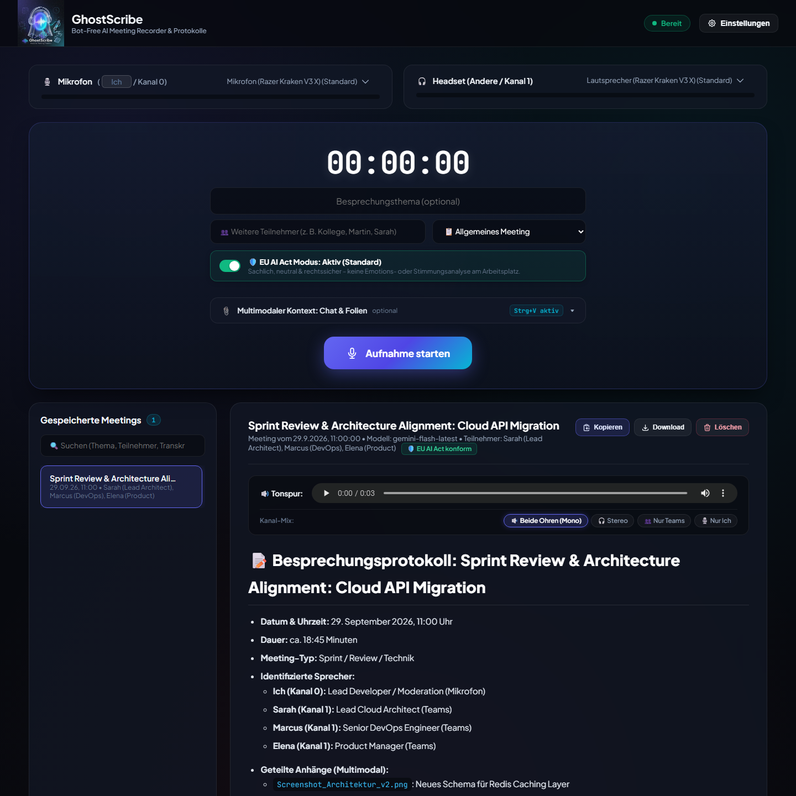
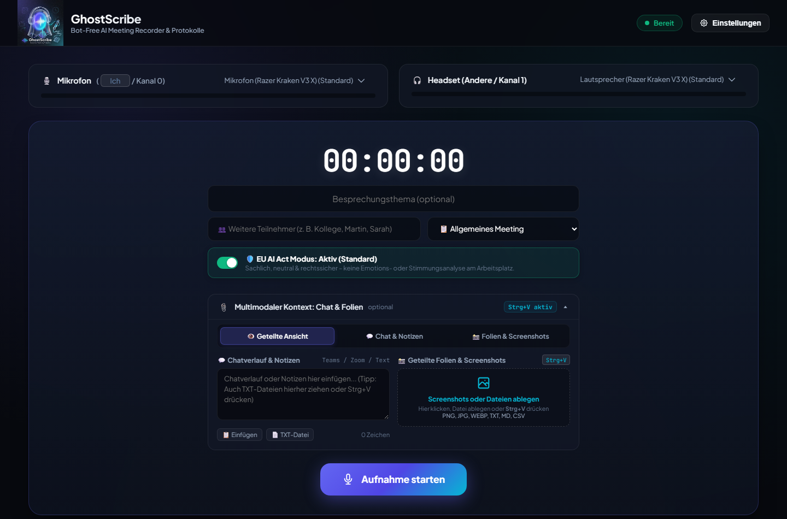

<div align="center">
  

# GhostScribe

**Bot-free meeting recorder for Windows that turns Teams and Zoom calls into structured minutes with Google Gemini.**

[](https://github.com/OWNER/REPO/actions/workflows/ci.yml)


[](LICENSE)

</div>



GhostScribe records your microphone and your computer's audio output as two separate channels, so no meeting bot has to join the call. When you stop the recording, Gemini turns it into a protocol with summary, decisions, action items and transcript. The user interface and the protocols are in German.

## Features

- **Two-channel recording:** microphone and system audio (WASAPI loopback) are stored on separate channels; a channel timeline tells Gemini who spoke when.
- **Structured protocols:** management summary, decisions, prioritized action items, open questions and transcript, with focus templates for sprints, sales calls, interviews and brainstorming.
- **Meeting context:** add chat history, notes and screenshots of shared slides (paste with Ctrl+V).
- **EU AI Act mode (default):** no emotion or sentiment analysis. The optional sentiment mode requires explicit confirmation.
- **Local storage:** recordings and protocols stay on your PC; files uploaded to Gemini are deleted after the analysis.
- **Channel mixer:** play back both channels, only yourself or only the other participants.

## Requirements

- Windows 10 or 11 (x64)
- Python 3.11 or newer
- A Google Gemini API key, free at [Google AI Studio](https://aistudio.google.com/app/apikey)
- Optional: [FFmpeg](https://ffmpeg.org/) in `PATH`, which compresses recordings to MP3 for about ten times faster uploads

## Installation

1. Download `GhostScribe-v1.0.0-windows.zip` from the [latest release](../../releases/latest) and extract it.
2. Double-click `start.bat`. The first start creates a virtual environment and installs the dependencies; no admin rights are needed.
3. The browser opens http://localhost:8765. Enter your Gemini API key under **Einstellungen**.

To run from source instead, clone the repository and start `start.bat` in the same way. `.venv\Scripts\python main.py --cli` starts a terminal version without the web interface.

## Usage

1. Select your microphone and the output device your meeting app plays through, and optionally enter topic, participants and meeting type.
2. Click **Aufnahme starten**. The recording continues even if you close the browser tab.
3. Optionally add chat history, notes or screenshots during the meeting.
4. Click **Aufnahme beenden & Analysieren**. The protocol appears after about a minute.

If an analysis fails, for example because of a rate limit, the recording is listed under **Nicht analysierte Aufnahmen** and can be analyzed again.



## Configuration

Settings are stored in `.env`, which is created from `.env.example` and can be edited in the web interface.

| Variable | Default | Description |
|---|---|---|
| `GEMINI_API_KEY` | | Google Gemini API key |
| `GEMINI_MODEL` | `gemini-flash-latest` | Gemini model used for the protocol |
| `AI_ACT_MODE` | `true` | Default mode: `true` is EU AI Act compliant, `false` adds sentiment analysis |

## Privacy and legal notes

- Recordings (`recordings/`) and protocols (`meetings/`) are stored locally only.
- For the analysis, the audio file and attached screenshots are uploaded to the Google Gemini API and deleted there afterwards. [Google's API terms](https://ai.google.dev/gemini-api/terms) apply; on the free tier, Google may use submitted content to improve its products.
- **Inform all participants and get their consent before recording.** Recording conversations without consent is a criminal offence in many countries (for example § 201 StGB in Germany), and processing voice data is subject to the GDPR.
- The EU AI Act prohibits emotion recognition in the workplace and in education (Art. 5(1)(f)). Keep the default mode in these settings.

## Development

```
pip install -r requirements-dev.txt
ruff check . && ruff format --check .
pytest
python scripts/build_release.py
```

`scripts/build_release.py` creates `dist/GhostScribe-v<version>-windows.zip`, which contains only the files end users need.

## License

[MIT](LICENSE)
