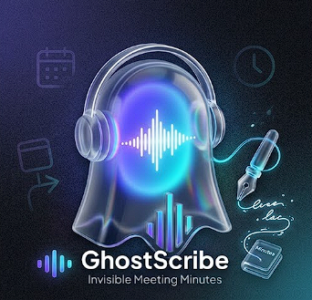
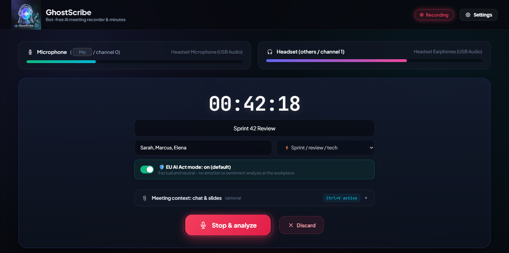
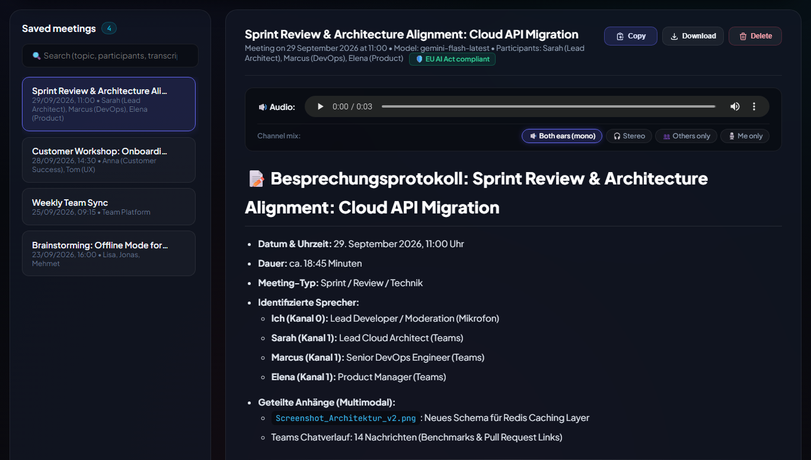

<div align="center">
  

# GhostScribe

**Bot-free meeting recorder for Windows, macOS and Linux that turns Teams and Zoom calls into structured minutes with Google Gemini.**

[](https://github.com/2g4y1/GhostScribe/actions/workflows/ci.yml)


[](LICENSE)



</div>

GhostScribe records your microphone and your computer's audio output as two separate channels, so no meeting bot has to join the call. When you stop the recording, Gemini turns it into structured minutes with summary, decisions and action items. The interface is available in English and German; the minutes are written in German.

## Features

- **Two-channel recording:** microphone and system audio are stored on separate channels (Windows: WASAPI loopback of the playback device, Linux: its PulseAudio/PipeWire monitor, macOS: a virtual audio device such as BlackHole); a channel timeline tells Gemini when you and when the others were speaking.
- **Crash-safe:** the audio is written to disk while recording. If the program is closed or the PC crashes during a meeting, the recording is recovered at the next start.
- **Structured minutes:** management summary, decisions, prioritized action items, open questions and a cleaned-up transcript, with focus templates for sprints, sales calls, interviews and brainstorming.
- **Any spoken language:** the minutes are written in German and the transcript keeps the spoken language. For languages other than German and English, the viewer switches the transcript between the original and a German translation. Meetings over 45 minutes get a condensed course with key quotes instead of a full transcript.
- **Voice profiles (optional, local):** GhostScribe separates the voices of the other participants on this computer and recognizes them in later meetings. Name a voice once, with the person's consent, and it is named automatically from then on.
- **Meeting context:** after the recording, add chat history, notes and screenshots of shared slides (paste with Ctrl+V).
- **EU AI Act mode (default):** no emotion or sentiment analysis. The optional sentiment mode is switched on in the settings and requires explicit confirmation.
- **Local storage:** recordings and minutes stay on your computer; files uploaded to Gemini are deleted after the analysis.
- **Search and playback:** full-text search across all meetings and playback of every recording.

## Requirements

- Windows 10 or 11 (x64), macOS 11 or newer (Apple silicon or Intel), or Linux (x64 or ARM64) with PulseAudio or PipeWire
- Python 3.11 to 3.14
- A Google Gemini API key, free at [Google AI Studio](https://aistudio.google.com/app/apikey)
- Optional: [FFmpeg](https://ffmpeg.org/) in `PATH`, which compresses recordings to a mono MP3 so that uploads are about ten times smaller (`winget install ffmpeg`, `brew install ffmpeg`, `sudo apt install ffmpeg`)
- macOS only: a virtual audio device for the system audio, see [macOS: recording the system audio](#macos-recording-the-system-audio)

## Installation

1. Download `GhostScribe-v<version>.zip` from the [latest release](../../releases/latest) and extract it. The release page also lists its SHA-256 checksum.
2. Start GhostScribe. The first start creates a virtual environment and installs the dependencies (every package is checked against its pinned checksum); no admin rights are needed.
   - **Windows:** double-click `start.bat`.
   - **macOS:** double-click `start.command`. The first time, macOS may refuse to open a downloaded script: right-click it, choose **Open** and confirm. Allow the Terminal to use the microphone when macOS asks.
   - **Linux:** run `sh start.sh` in a terminal. On Debian and Ubuntu, the setup needs `sudo apt install python3-venv` first.
3. The browser opens http://localhost:8765. Enter your Gemini API key under **Settings**, where you can also switch the language.

The console window keeps the address and its keys at the bottom: **R** restarts the server after a confirmation (not during a recording or an analysis), for example after an update; **Ctrl+C** quits.

To run from source instead, clone the repository and start it in the same way. `start.bat --cli` (Windows) or `sh start.sh --cli` (macOS, Linux) starts a terminal version without the web interface.

### macOS: recording the system audio

macOS cannot record what the other participants say by itself. Install the free virtual audio device [BlackHole](https://github.com/ExistentialAudio/BlackHole) (2ch), then open **Audio MIDI Setup**, create a **Multi-Output Device** with your speakers or headset plus BlackHole 2ch, and select it as the sound output (or as the speaker in Teams/Zoom). You keep hearing the meeting, and GhostScribe selects BlackHole as the playback device automatically.

## Usage

1. Select your microphone and the **playback device** your meeting app plays through, and optionally enter topic, participants and meeting type.
2. Click **Start recording**. The recording continues even if you close the browser tab, as long as the GhostScribe console window stays open.
3. Click **Stop recording**. Optionally add the chat history, notes or screenshots of shared slides (paste with Ctrl+V), correct topic or participants if needed, and click **Analyze**.
4. Gemini writes the minutes in the background, which takes from under a minute to a few minutes depending on the length of the recording. They open automatically when ready; earlier meetings are under **Saved meetings**.

<p align="center">
  
  
</p>
<p align="center"><sub>Left: context added after the recording (step 3). Right: saved meetings and minutes with audio playback (step 4).</sub></p>

With **Later**, or if an analysis fails, for example because of a rate limit, the recording stays under **Recordings not yet analyzed**, where you can add context and analyze it at any time. A recording that was interrupted by a crash appears there too after the next start.

## Configuration

Settings are stored in `.env`, which is created from `.env.example` and can be edited in the web interface.

| Variable | Default | Description |
|---|---|---|
| `GEMINI_API_KEY` | | Google Gemini API key |
| `GEMINI_MODEL` | `gemini-flash-latest` | Gemini model used for the minutes |
| `AI_ACT_MODE` | `true` | Default mode: `true` is EU AI Act compliant, `false` adds sentiment analysis |
| `UI_LANGUAGE` | browser language | Interface language, for example `en` or `de` |
| `VOICE_RECOGNITION` | `false` | Local voice recognition and voice profiles |
| `VOICE_WORKERS` | `1` | Parallel processes for the voice recognition of long recordings (at most half of the logical processors) |

## Adding a language

Each language is one JSON file in `ghostscribe/static/locales/`. Copy `en.json` to a file named after the two-letter language code (for example `fr.json`), translate the values, keep the `{placeholders}`, and set `meta.name` (shown in the language list) and `meta.locale` (date and number format). After a restart, the language appears in the settings. `pytest` checks that every language has the same keys and placeholders as English.

## Privacy and legal notes

- Recordings (`recordings/`) and minutes (`meetings/`) are stored locally only. The web interface is only reachable from this computer (127.0.0.1) and rejects requests from other websites.
- For the analysis, the audio file, the attached screenshots and the entered context (topic, participants, chat and notes) are sent to the Google Gemini API; uploaded files are deleted there afterwards. [Google's API terms](https://ai.google.dev/gemini-api/terms) apply; on the free tier, Google may use submitted content to improve its products.
- **Inform all participants and get their consent before recording.** Recording conversations without consent is a criminal offence in many countries (for example § 201 StGB in Germany), and processing voice data is subject to the GDPR.
- Voice recognition is off by default and runs entirely on this computer. Its models (about 45 MB, [sherpa-onnx](https://github.com/k2-fsa/sherpa-onnx) with pyannote segmentation 3.0 and NVIDIA NeMo TitaNet) are downloaded once into `models/` and checked against their SHA-256 checksums. Voice profiles are biometric data (Art. 9 GDPR): they are only saved after you confirm the person's consent, stay in `voices/` and can be deleted in the settings.
- The EU AI Act prohibits emotion recognition in the workplace and in education (Art. 5(1)(f)). Keep the default mode for meetings at work or in education.

## Development

```
pip install -r requirements-dev.txt
ruff check . && ruff format --check . && mypy
pytest
npm ci && npm run lint
python scripts/build_release.py
```

The application is the `ghostscribe` package (`python -m ghostscribe`): `console.py` runs the server in a child process below the banner of the console window, `app.py` serves the web interface and API, `recorder.py` writes the two-channel recording, `audio.py` captures the inputs on each operating system, `analyzer.py` runs the Gemini analysis, `voices.py` recognizes voices locally, and `static/` contains the web interface. `scripts/build_release.py` creates `dist/GhostScribe-v<version>.zip`, which contains only the files end users need.

See [CONTRIBUTING.md](CONTRIBUTING.md) for the dependency lock files, the checks and the release process, [SECURITY.md](SECURITY.md) for reporting vulnerabilities, and [CHANGELOG.md](CHANGELOG.md) for the changes of each version.

## License

[MIT](LICENSE)
